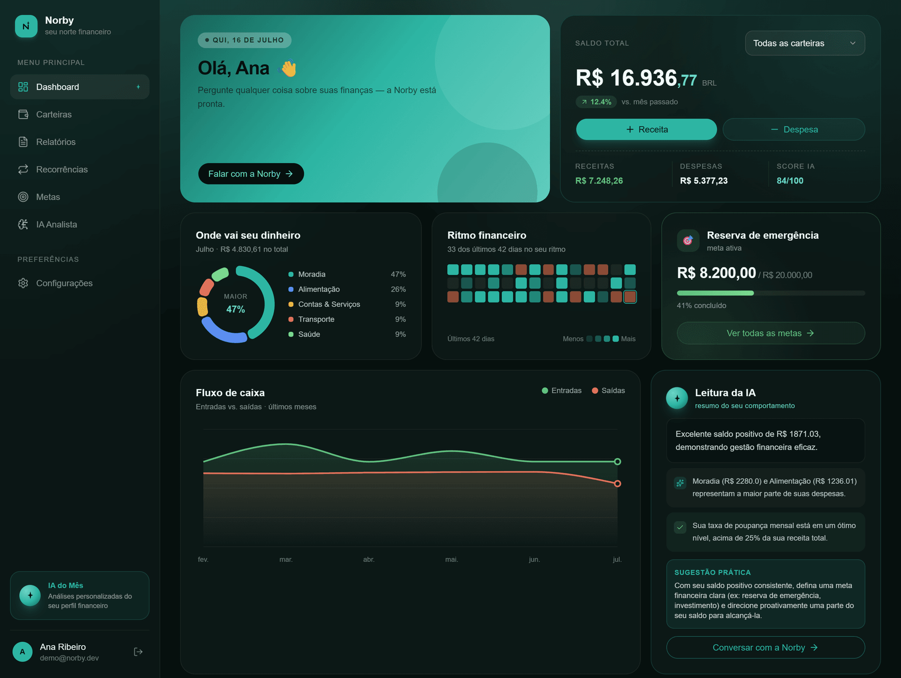
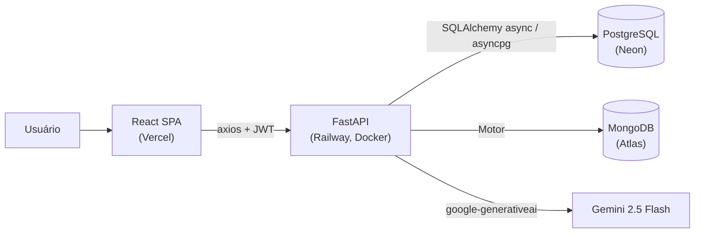

# Norby

Um organizador financeiro pessoal com um analista de IA junto. Você registra carteiras, transações, recorrências e metas; o Google Gemini lê esses números e devolve um score, uma leitura curta do mês e um chat que responde sobre o seu próprio dinheiro.

**Demo:** [norby-finance.vercel.app](https://norby-finance.vercel.app) · **API (Swagger):** [norby-production.up.railway.app/docs](https://norby-production.up.railway.app/docs)



*Conta de demonstração, populada por [seed_demo.py](backend/scripts/seed_demo.py) — nenhum dado financeiro real.*

## O problema

Controle financeiro em planilha não falha por falta de recurso, falha no hábito. Lançar é chato, o saldo envelhece sem avisar e, no fim, ninguém senta para interpretar os números.

O Norby junta os lançamentos num lugar só (recorrências incluídas), mantém os saldos consistentes no banco e transforma o mês numa leitura curta e acionável, escrita por IA. O objetivo é simples de dizer e difícil de entregar: o usuário confia no número à primeira vista e volta no dia seguinte sem fricção.

## Stack

| Camada | Tecnologias |
|---|---|
| Backend | FastAPI 0.115 · SQLAlchemy 2.0 (async) + asyncpg · Alembic · Pydantic v2 · python-jose (JWT) · slowapi (rate limit) · uv |
| Bancos | PostgreSQL 16 (núcleo relacional) · MongoDB 7 via Motor (insights e chat da IA) |
| IA | Google Gemini 2.5 Flash (`google-generativeai`) |
| Frontend | React 19 · Vite 8 · TailwindCSS · componentes estilo shadcn/ui · Zustand · React Router v7 · React Hook Form + Zod · axios · Recharts |
| Testes | pytest + pytest-asyncio (backend) · Vitest + Testing Library (frontend) |
| Infra | Docker Compose (dev) · Railway (backend, Docker) · Neon (Postgres) · MongoDB Atlas · Vercel (frontend) |

## Arquitetura

Monorepo, com a SPA e a API separadas. O frontend está na Vercel e conversa com a API FastAPI (Railway) por axios, autenticando com JWT.

A divisão dos dados segue o que cada um é. O núcleo financeiro (usuários, carteiras, transações, recorrências, metas, refresh tokens) fica no PostgreSQL. Os blocos de texto que a IA gera (insight do mês e histórico de chat) ficam no MongoDB. O Gemini só é chamado pelo backend, e apenas nos recursos de IA.



## Decisões técnicas de destaque

- **O score é calculado, não inventado.** O número de 0 a 100 sai de uma regra fixa sobre quanto você poupou no mês ([score_service.py](backend/app/services/score_service.py)). O Gemini escreve o texto ao redor, nunca o número. O motivo está comentado no código: assim o score é previsível, dá para testar e aparece na hora, três coisas que um LLM não garante.

- **A leitura da IA expira sozinha quando os dados mudam.** O texto é guardado por usuário e por mês, junto com um hash SHA-256 dos números que o originaram ([ai_service.py](backend/app/services/ai_service.py)). Mexeu numa transação, o hash muda e o texto é reescrito na próxima carga. Sem isso restariam duas opções ruins: chamar o Gemini a cada abertura de tela, ou deixar uma leitura congelada afirmando uma coisa enquanto o dashboard mostra outra.

- **PostgreSQL e MongoDB juntos, sendo que JSONB teria bastado.** O dinheiro vive no relacional, com FKs `ondelete=CASCADE`, `Numeric(15,2)` e locks. O Mongo guarda o cache do insight e o histórico de chat.

  Esta é a decisão mais fraca do projeto, e prefiro documentá-la a maquiá-la. O Mongo entrou por ser padrão da minha stack, não por exigência do problema: a alternativa nunca chegou a ser avaliada. Os documentos têm schema fixo (`user_id`, `reference_month`, `data_fingerprint`, `summary_text`) e um índice único em (`user_id`, `reference_month`). Ou seja: é uma tabela, não um documento flexível.

  O segundo banco cobra o preço no código, e dá para ver onde. Como não existe FK entre bancos, a exclusão da LGPD precisa apagar o Mongo à mão, e as duas escritas não compartilham transação ([account_service.py](backend/app/services/account_service.py)). O script [dedupe_ai_insights.py](backend/scripts/dedupe_ai_insights.py) só existe porque o Mongo aceitou duplicatas que uma UNIQUE constraint teria barrado na origem.

  Existe um ganho real: isolar dado descartável (cache e chat crescem sem limite) do núcleo transacional. Mas é razão que encontrei depois, não critério que usei antes. Fica na v1 porque já está em produção. Recomeçando, seria JSONB no Postgres.

- **Async de ponta a ponta, com o trabalho bloqueante fora do event loop.** SQLAlchemy async, asyncpg e Motor cuidam do I/O. O bcrypt e o SDK síncrono do Gemini são as duas peças que travariam o servidor, então rodam via `asyncio.to_thread` ([auth.py](backend/app/routers/auth.py), [ai_service.py](backend/app/services/ai_service.py)).

- **FastAPI, sendo Django a minha stack padrão.** A origem foi aprendizado: eu queria conhecer o framework construindo algo real, não lendo sobre ele.

  Mas ele se sustenta no problema. A carga aqui é I/O-bound no sentido mais literal: cada request de IA fica segundos parado esperando o Gemini responder, e o app ainda conversa com dois bancos. Como roda **uma** instância (ver o rate limit em memória, nas limitações), um worker síncrono preso esperando o LLM é exatamente o gargalo. Async é o que mantém a API atendendo enquanto o modelo pensa.

  O preço foi real e está no código. Sem `django.contrib.auth`, o JWT com rotação de refresh, o hash de senha e o escopo por usuário são código meu. É parte de por que os 85 testes do backend existem.

- **Saldo persistido, com lock de linha.** O `Wallet.balance` é atualizado por deltas centralizados ([transaction_service.py](backend/app/services/transaction_service.py)) sob `SELECT ... FOR UPDATE`, cobrindo criar, editar, excluir e recorrência sem corrida.

  Por que não somar as transações a cada leitura: a carteira nasce com um saldo inicial, que não é lançamento. A coluna existiria de qualquer forma, então a escolha real nunca foi "ter ou não ter coluna", e sim somar os deltas na escrita ou na leitura.

  Persistir dá leitura O(1) e cobra disciplina, porque todo caminho de escrita precisa aplicar ou reverter o delta. O lock existe por um motivo concreto: duas escritas simultâneas na mesma carteira se sobrescreviam. Há um teste que reproduz essa corrida e falha sem o lock ([test_transactions.py](backend/tests/test_transactions.py)). Sendo justo com a alternativa: `saldo_inicial + SUM` seria imune a divergência por construção e dispensaria o lock. Nesta escala, seria a escolha mais conservadora.

- **Refresh token opaco, com rotação.** O access token JWT dura 15 minutos. O refresh dura 7 dias, é guardado só como hash SHA-256, é rotacionado a cada uso e revogado no logout ([auth_service.py](backend/app/services/auth_service.py)). No frontend, um interceptor do axios renova em caso de 401 usando fila única, para não disparar N refreshes concorrentes.

- **Recorrências materializadas de forma preguiçosa.** Não existe scheduler no servidor. O frontend chama `POST /recurring/run` no boot ([App.jsx](frontend/src/App.jsx)) e as ocorrências vencidas viram transações de verdade ([recurring_service.py](backend/app/services/recurring_service.py)). O catch-up é um `while next_run_date <= now` que grava cada ocorrência **na data em que ela venceu**, não em "hoje": quem passa três meses fora volta com o histórico correto, só tardio.

  Por que não um worker: o único leitor desses dados é o próprio usuário, e o gatilho é ele abrir o app. O atraso é invisível para o único observador que existe. Em troca, o projeto dispensa um segundo processo na Railway, com cron para monitorar, execuções sobrepostas e drift de horário.

  A decisão tem prazo de validade explícito. Ela vale enquanto nada do lado do servidor precisar ler esses dados sem o usuário presente. No dia em que existir notificação do tipo "seu aluguel vence amanhã", o scheduler deixa de ser opcional. Não é coincidência que notificações estejam fora do escopo da v1.

- **Agregação do dashboard feita no banco.** KPIs, fluxo de caixa dos 6 meses e top categorias saem de SQL sobre todas as transações ([dashboard_service.py](backend/app/services/dashboard_service.py)). A versão anterior agregava no cliente, sobre as 200 transações mais recentes, e por isso errava justamente para quem usa o app com frequência. O motivo está comentado no código.

- **Compatibilidade Neon/asyncpg resolvida na configuração.** O Neon manda parâmetros libpq na URL (`sslmode`, `channel_binding`) que o asyncpg rejeita. O [config.py](backend/app/config.py) normaliza a URL e liga o SSL via `connect_args`. O Alembic reusa a mesma lógica.

- **Todo acesso a dado é escopado por usuário.** Nenhuma query confia em id vindo do corpo da requisição: a posse é checada, e recurso de outra pessoa responde 404. A convenção está fixada no [AGENTS.md](AGENTS.md) e é testada com dois usuários.

## Como usei IA no desenvolvimento

Boa parte do código foi escrita com assistência de IA (Claude Code), mas sob método explícito. Os arquivos de governança estão versionados no repo:

- [AGENTS.md](AGENTS.md) é a fonte de verdade operacional que qualquer agente segue: convenções de arquitetura, regras duras de segurança (escopo por `user_id`, revisão obrigatória de migrations, nunca commitar segredos ou direto na `main`) e o escopo congelado da v1, que é o que impede a IA de inventar feature.
- [PRODUCT.md](PRODUCT.md) e [DESIGN.md](DESIGN.md) fixam persona, anti-referências e princípios de design, para o trabalho de UI assistido não derivar para template genérico.
- [.mcp.json](.mcp.json) configura o Playwright MCP: o agente confere as mudanças dirigindo a UI real no navegador, em vez de só ler código.

A trajetória está no `git log`. No começo eu usava IA só para tirar dúvida e caçar bug, e o projeto empacou: **9 commits no primeiro dia, e 4 na semana inteira seguinte**. Quando passei a usá-la para implementar feature, sob o método acima, foram **35 commits em dois dias**. O que estava pendente saiu do papel, e bugs que passariam despercebidos por mim apareceram (os `fix(wave-*)` são disso).

Como dev júnior, evito depender totalmente dela. Mas o cenário tornou a ferramenta indispensável, e preferi aprender a dirigi-la a fingir que não uso. Ela me tirou de gargalos reais e criou outros. Os dois exemplos abaixo são dos dois tipos.

**O que pedi, e por que cobrei de novo.** O dashboard mostrava receita de R$ 4.050 ao lado de um score 5/100 e uma leitura dizendo "você não teve receita". Pedi a revisão. A investigação mostrou que o score vinha do LLM e ficava congelado no cache do Mongo, com documentos duplicados por corrida. O primeiro conserto não bastou: o sintoma voltou, porque sobrara um campo antigo no cache.

A insistência é auditável no histórico. [`31e2951`](https://github.com/DigoDuck/Norby/commit/31e2951) cria o score determinístico, [`5429a62`](https://github.com/DigoDuck/Norby/commit/5429a62) passa a invalidar o texto por fingerprint, e [`02c4384`](https://github.com/DigoDuck/Norby/commit/02c4384) apaga o score legado e cria o índice único. Foram dois `feat` e quatro `fix` até o sintoma sumir de vez, e o resultado é a arquitetura descrita acima.

**Bug caçado no uso real.** Transação criada no dia 29 aparecia como dia 28. Código gerado por IA tratava a data como um instante em UTC, e o fuso local puxava um dia para trás.

Só que não era um bug, era uma classe de bug: o mesmo erro tinha vazado para quatro camadas. Exibição ([`6d67bce`](https://github.com/DigoDuck/Norby/commit/6d67bce)), modelagem, com o `Transaction.date` virando `DATE` ([`d7461f1`](https://github.com/DigoDuck/Norby/commit/d7461f1)), agregação do dashboard ([`047ba6e`](https://github.com/DigoDuck/Norby/commit/047ba6e)) e recorte de mês ([`7cc1ac3`](https://github.com/DigoDuck/Norby/commit/7cc1ac3)). Achei pelo sintoma na tela e segui até o tipo errado no banco.

## Validação

- **Backend: 85 testes** (pytest + pytest-asyncio). Cobrem auth (registro, login, refresh com rotação), CRUD de todos os recursos com checagem de posse entre dois usuários, materialização de recorrências, metas, score determinístico, contrato do insight da IA e observabilidade (request-id). Rodam contra um Postgres real de teste (`norby_test`), com o schema criado e destruído a cada teste. Comando: `pytest` em `backend/`.
- **Frontend: 24 testes** (Vitest + Testing Library). Cobrem o store de auth, os schemas Zod, utilitários e componentes compartilhados. Comando: `npm run test` em `frontend/`.
- Sem CI configurado: os testes rodam localmente antes do merge.

## Conformidade (LGPD)

O projeto trata dados financeiros pessoais, e isso está documentado em [LGPD.md](LGPD.md): inventário de dados com base legal, compartilhamento com operadores (Gemini, hospedagem) e os direitos do titular que estão de fato implementados no produto.

São dois, e ambos funcionam de verdade. Exportação de todos os dados em JSON (`GET /auth/me/export`) e exclusão definitiva da conta (`DELETE /auth/me`), que apaga o Mongo explicitamente e o Postgres por cascade. É documentação técnica de portfólio, e não substitui revisão jurídica.

## Rodar localmente

Pré-requisitos: Docker + Docker Compose, Node 20+.

```bash
git clone https://github.com/DigoDuck/Norby.git
cd Norby
cp .env.example .env          # ajuste SECRET_KEY e GEMINI_API_KEY

# Postgres + Mongo + backend (API em http://localhost:8000, Swagger em /docs)
docker-compose up

# aplica as migrations (o compose de dev sobe com --reload, sem migrar)
docker compose exec backend alembic upgrade head

# frontend (http://localhost:5173)
cd frontend
npm install
npm run dev
```

Os recursos de IA exigem uma chave do [Google AI Studio](https://aistudio.google.com/) em `GEMINI_API_KEY`.

## Limitações & roadmap

Limitações conhecidas, aceitas conscientemente na v1:

- Recorrências só materializam quando o usuário abre o app (sem scheduler server-side).
- Rate limiting em memória, por IP. Não sobrevive a múltiplas instâncias nem a restart.
- Sem CI e sem linter no backend (o frontend tem ESLint).
- O consentimento LGPD é validado no cadastro, mas ainda não é persistido com timestamp e versão dos termos.
- Fora do escopo da v1: multi-moeda, Open Finance, export CSV/PDF, CRUD de categorias, notificações e metas compartilhadas.

Próximos passos: auditoria de segurança mais profunda, i18n, persistência do consentimento e CI.
